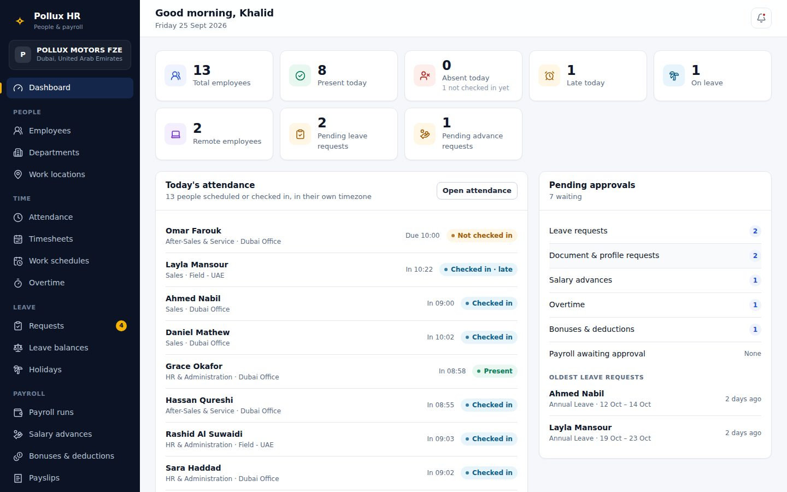
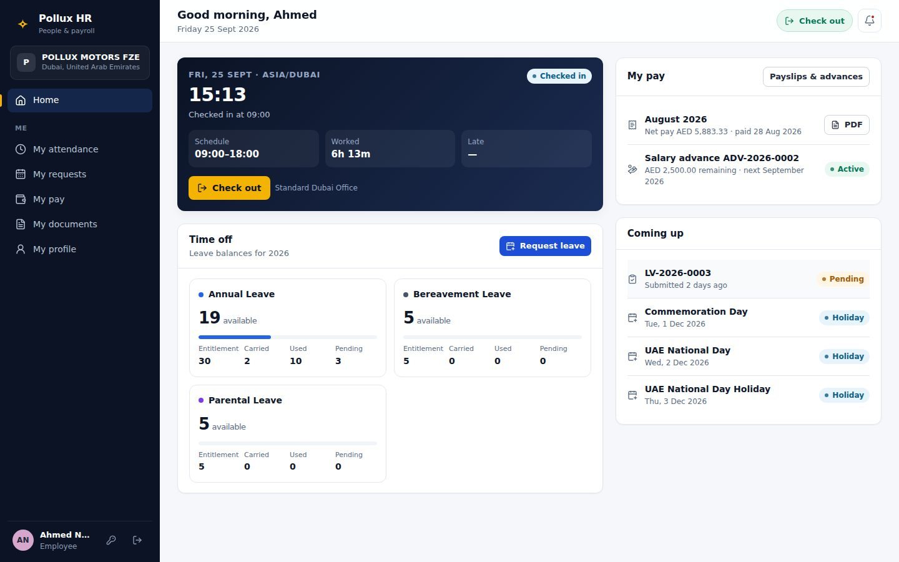
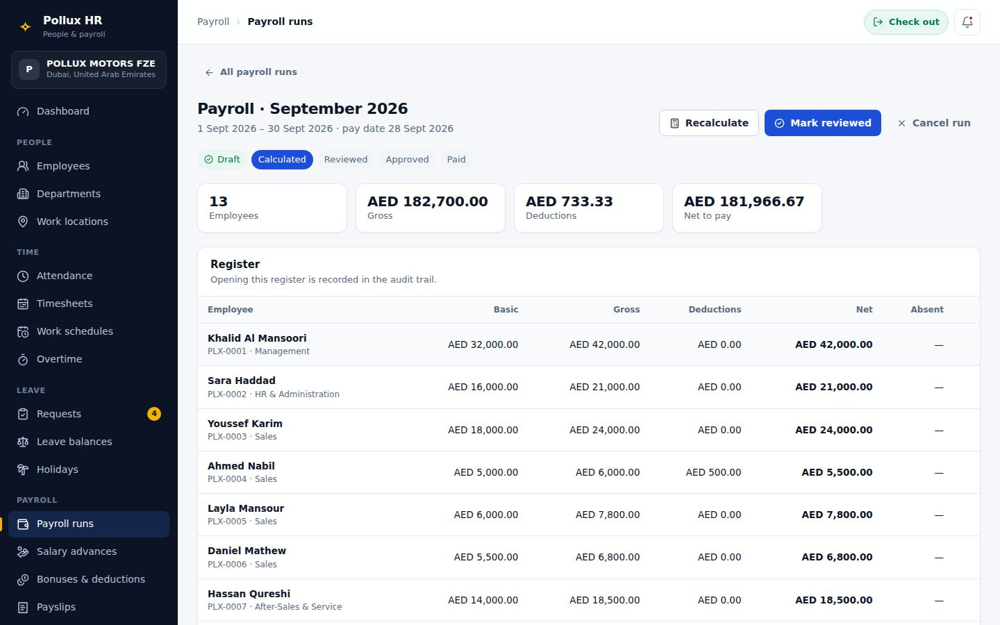
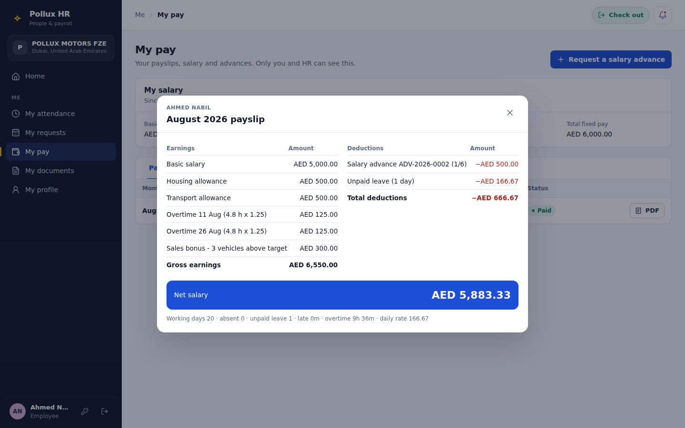
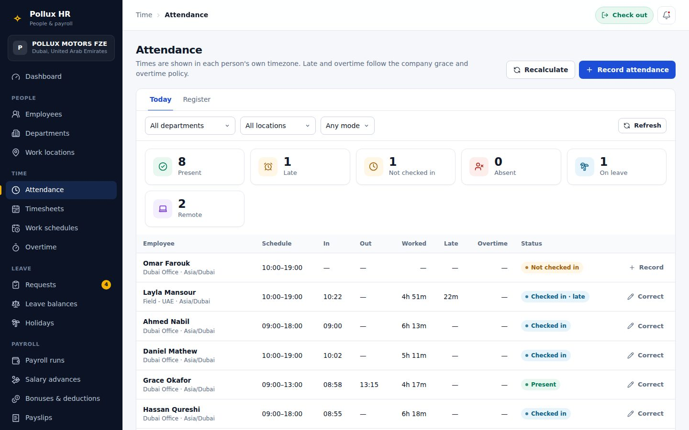
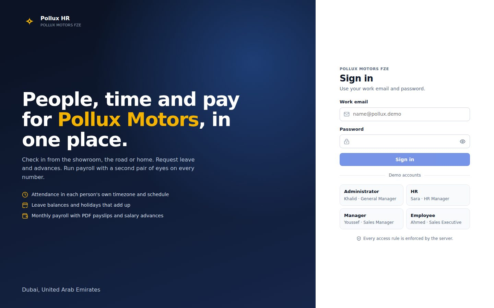
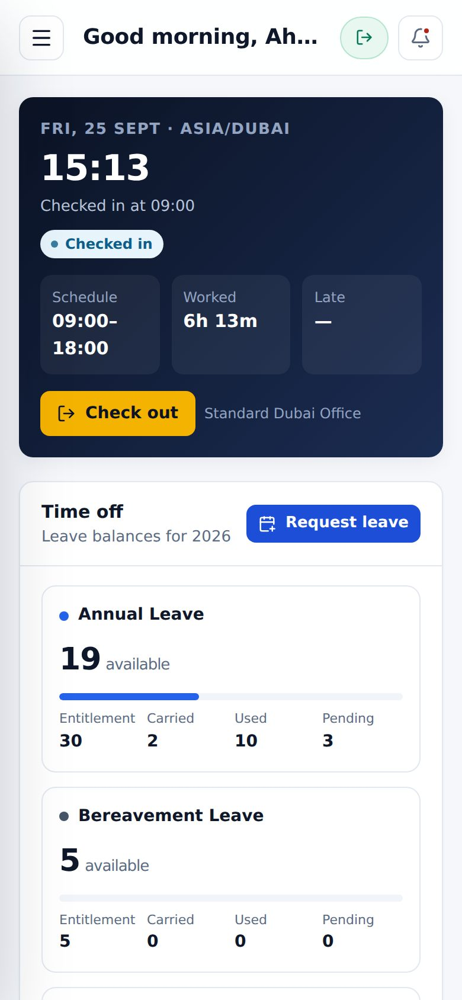

<div align="center">

# Pollux HR

### People, attendance, leave and payroll for POLLUX MOTORS FZE, Dubai


</div>

---

Pollux HR answers the questions a growing car dealership asks every day: *who is in
today, who is late, who is on leave, what do we pay each person this month — and what
does each employee need to see about their own time and pay.* One company, one Dubai
office, people in the field, and colleagues working remotely from Cairo and Algiers,
each judged against their own schedule, timezone and holiday calendar.



## What it does

| Area | Highlights |
|---|---|
| **People** | Employee file with tabs — Overview, Personal, Employment, Attendance, Leave, Salary, Advances, Payroll, Documents, Timeline — shown only to those allowed to see them. Departments, work locations (Dubai Office, Field, Remote) |
| **Time** | One-tap check-in/out on the web or a phone; Present / Late / Partial / Absent / Missing check-out computed on the server in each person's own timezone; today board, timesheets, calendar; reusable work schedules; overtime from attendance with approval; HR corrections with a mandatory reason |
| **Leave** | Requests with a live preview of the working days they cost; HR can record leave on someone's behalf, including leave that has already started, and approve it in one step; balances shown as *entitlement + carried − used − pending = available*; UAE holiday calendar by default, other calendars assigned per person |
| **Payroll** | Monthly runs `Draft → Calculated → Reviewed → Approved → Paid` with four-eyes approval, month locking and admin-only reopen; salary advances repaid in instalments; bonuses and deductions; PDF payslips stored at approval |
| **Reports** | Attendance, late arrivals, absence, overtime, leave, leave balance, payroll, salary advances, employees — preview on screen, export as CSV, Excel or PDF, every export audited |
| **Administration** | Users & roles, audit logs with before/after, company settings — every policy number lives in the database, not in code |

<table>
<tr>
<td width="50%" valign="top"></td>
<td width="50%" valign="top"></td>
</tr>
<tr>
<td align="center"><em>An employee's day: check in, time off, pay</em></td>
<td align="center"><em>A payroll run, from calculation to payment</em></td>
</tr>
<tr>
<td width="50%" valign="top"></td>
<td width="50%" valign="top"></td>
</tr>
<tr>
<td align="center"><em>Every line of a payslip, rounded once, adding up exactly</em></td>
<td align="center"><em>Today's attendance, each person in their own timezone</em></td>
</tr>
</table>

<table>
<tr>
<td width="68%" valign="top"></td>
<td width="32%" valign="top"></td>
</tr>
<tr>
<td align="center"><em>Sign in</em></td>
<td align="center"><em>On a phone: check in from the showroom, the road or home</em></td>
</tr>
</table>

## The rules that matter

- **Money is never a floating-point number.** Every amount is a decimal from the database
  to the payslip; each line is rounded once and totals are sums of rounded lines. The
  brief's example comes out exactly: gross **6,550.00**, deductions **666.67**, net
  **5,883.33**.
- **A payroll cannot drift.** Records snapshot every figure; approval re-runs the
  calculation and refuses if anything changed since review; overtime, bonuses and advance
  instalments are linked to the payslip line that paid them, so nothing is paid twice;
  an approved month is locked.
- **Managers never see pay.** A line manager approves their team's leave and overtime
  minutes but cannot read a salary, payslip, advance or overtime amount — enforced in
  one file, [`services/access.ts`](Employee%20Management%20Platform%20BackEnd/src/services/access.ts),
  and proven by the E2E suite with each role's own token.
- **Nobody approves their own request, overtime, advance or payroll.**
- **Every sensitive action is audited** — corrections, approvals, payroll steps, exports,
  reading someone else's salary.

## Demo accounts

Password for every account: **`Passw0rd!23`** (the seed's `SEED_DEMO_PASSWORD` default —
demo data only). In development the login page has one-click fillers; a production build
shows them only when built with `VITE_DEMO_ACCOUNTS=true`.

| Role | Email | Who |
|---|---|---|
| Administrator | `admin@pollux.demo` | Khalid Al Mansoori, General Manager |
| HR | `hr@pollux.demo` | Sara Haddad, HR Manager |
| Manager | `manager@pollux.demo` | Youssef Karim, Sales Manager (Ahmed, Layla, Daniel report to him) |
| Employee | `employee@pollux.demo` | Ahmed Nabil, Sales Executive |
| Employee (field) | `layla.mansour@pollux.demo` | Layla Mansour, Senior Sales Executive |
| Employee (remote, Cairo) | `nour.elsayed@pollux.demo` | Nour El-Sayed — Egyptian holiday calendar |
| Employee (remote, Algiers) | `amine.benali@pollux.demo` | Amine Benali — follows the UAE calendar |

## Quick start

Requires Node 20+ and Docker.

```bash
cd "Employee Management Platform BackEnd" && npm install && cp .env.example .env && npm run db:up && npx prisma migrate deploy && npm run db:seed && npm run dev
```

```bash
cd "Employee Management Platform FrontEnd" && npm install && npm run dev
```

Open <http://localhost:5173>. The API is on `http://localhost:4000` (health at `/health`);
Vite proxies `/api`, so the frontend needs no environment variable locally.

### For real use

`npm run db:setup` is the seed's counterpart for a real start: it clears the database and
creates POLLUX MOTORS FZE with its working configuration (Dubai Office, a Monday-to-Friday
schedule, UAE holidays, leave types) and only the accounts you pass in environment
variables, so real emails and passwords never enter the repository. See
[DEPLOYMENT.md, step 4a](DEPLOYMENT.md#4a-your-company-dbsetup).

### Tests

```bash
(cd "Employee Management Platform BackEnd" && npm run typecheck && npm test && npm run build)
(cd "Employee Management Platform FrontEnd" && npm test && npm run build)
(cd e2e && npm install && npx playwright install chromium && npm test)
```

The E2E suite migrates and seeds its own `pollux_e2e` database and starts both servers
itself, so it never touches your demo data. It covers the employee attendance, leave
request, salary advance, HR payroll and employee payslip flows, the permission
boundaries, and phone layouts. Set `PLAYWRIGHT_CHROMIUM_EXECUTABLE` to use a
preinstalled Chromium.

| Suite | Result |
|---|---|
| Backend integration — Vitest + Supertest against PostgreSQL | **293 / 293** |
| Frontend unit — client, adapters, formatting, navigation, audit diff, demo logins | **54 / 54** |
| E2E — Playwright, real stack, 1440×900 and 390×844 | **24 / 24** |
| Typecheck · backend build · frontend build · migrations from empty + seed | clean |

## Stack

React 19 + Vite · Express 4 + TypeScript · PostgreSQL + Prisma 6 · Zod · backend-issued
JWT with rotating refresh tokens · pdfkit, exceljs · Vitest, Supertest, Playwright.
No new framework was introduced: Pollux HR was built by extending the
[Matajer People Hub](https://github.com/taherfarg/matajer-employee-management-platform) codebase, and this repository keeps its full history.

## Documentation

| Document | What it covers |
|---|---|
| [docs/POLLUX-HR-ARCHITECTURE.md](docs/POLLUX-HR-ARCHITECTURE.md) | Modules, data model, migrations, frontend structure, configuration, demo data |
| [docs/ATTENDANCE-DESIGN.md](docs/ATTENDANCE-DESIGN.md) | Schedules, timezones, holiday calendars and every attendance rule |
| [docs/PAYROLL-DESIGN.md](docs/PAYROLL-DESIGN.md) | The payroll formula, the worked example, lifecycle, locking, payslips, advances, adjustments |
| [docs/PERMISSIONS.md](docs/PERMISSIONS.md) | Who can see and do what, and where each rule is enforced |
| [docs/POLLUX-HR-MIGRATION-PLAN.md](docs/POLLUX-HR-MIGRATION-PLAN.md) | The audit and plan written before the first change |
| [Backend README](Employee%20Management%20Platform%20BackEnd/README.md) · [Frontend README](Employee%20Management%20Platform%20FrontEnd/README.md) | Running, environment, API reference |
| [DEPLOYMENT.md](DEPLOYMENT.md) | Render + Neon |

## Known limitations

Payslips and reports are generated as PDF/Excel/CSV, but other documents are still
metadata plus letter text (no general file upload yet) · attendance has no GPS or
geofencing — the location is the assigned work location · no WPS/SIF bank file export
yet (payment is recorded with a reference) · end-of-service gratuity is not calculated ·
rate limiting is in-process · public holidays are illustrative, since Islamic dates move
with lunar observation.

<div align="center">

---

Demo data only — no real people.

</div>
